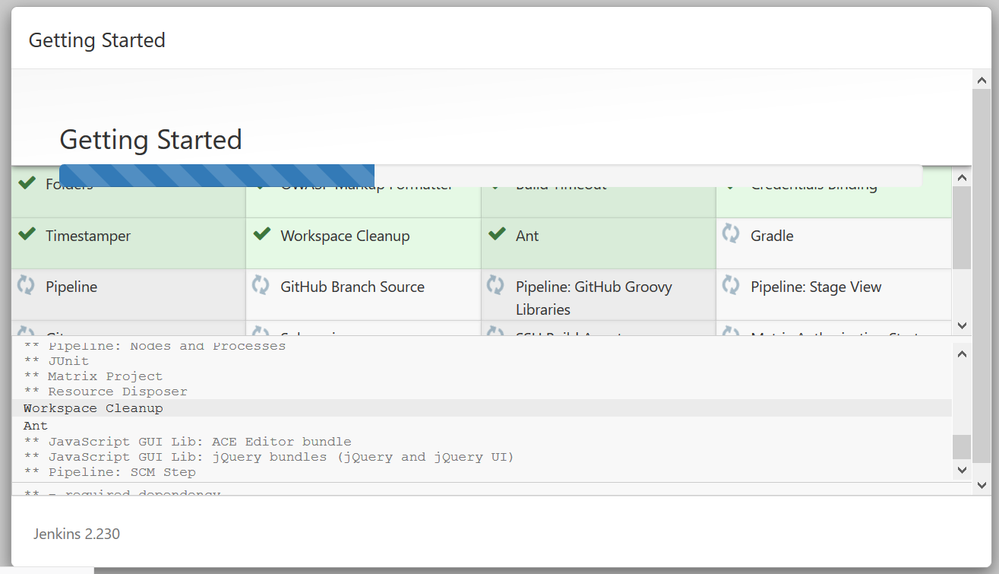

### Hot to install Jenkins on AWS LINUX AMI

- Pre-Requisite: Make sure you have JDK installed.
 ```
 sudo yum install java-1.8.0
 ```
then update yum repository as below.

```
sudo yum update –y
```


```
  sudo wget -O /etc/yum.repos.d/jenkins.repo http://pkg.jenkins-ci.org/redhat/jenkins.repo
  
sudo rpm --import https://pkg.jenkins.io/redhat/jenkins.io.key
  
sudo yum install jenkins -y
  
sudo service jenkins start
```

Then do 
<<public-ip>>:8080

if it's not connecting you may have to add / open port 8080 on Security Groups of jenkins server of EC2 instance.

should get below screen for password


copy pwd


should get two options
```
 Plugins extend Jenkins with additional features to support many different needs.
```

- Install suggested plugins;
- Select Plugins to install

Select 'Install Suggested plugins:' to install default plugins and for us to get ground running.

Which will start installing default plugins as below screenshot suggests.



Create first Admin user:


click 'save and continue'>>
Then "Save and Finish" >> Start using Jenkins

Should have jenkins up and running:
